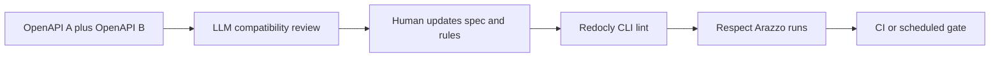

---
seo:
 title: Use AI to review API design for backward compatibility risks
 description: How to prompt an LLM to compare two OpenAPI versions for breaking changes, where human judgment ends, and how Redocly CLI plus Respect keep spec and live behavior aligned in CI.
---

# Use AI to review API design for backward compatibility risks

Your public OpenAPI file is a promise to every client that already shipped. When a field disappears, a type tightens, or a path renames, the break often shows up first in someone else’s production log. A large language model can read two snapshots and narrate what changed. It is not a contract test. Pair that review with [API standards and governance](https://redocly.com/docs/cli/api-standards) in CI using [Explore Redocly CLI](https://redocly.com/docs/cli/), then let [Redocly Respect](https://redocly.com/docs/respect/) exercise critical workflows against a real server.

This article covers what counts as breaking, how to prompt with two spec versions, and how CLI linting plus Respect’s Arazzo-aware runs complement AI judgment.

## Why compatibility risk hides in large specs

Breaking changes are not always obvious renames. Optional can become required, enums can lose values clients still send, or a response schema can drop a field your SDK exposed. Line-by-line YAML diffs fatigue humans fast. A model can hold both trees and highlight operations where caller behavior likely changed.

The model may still hallucinate a reorder as a semantic change, or miss runtime behavior the spec never captured. Treat it as a reviewer that returns a prioritized list, and treat CI as the judge that fails the merge until the list is addressed or ruled out.

## What counts as breaking for clients

Agree with consumers what “breaking” means before you prompt: removed paths, renamed fields, stricter types, new required properties, changed status semantics, narrower enums. Additive changes still belong in a changelog but need not fail the gate.

Have the model label each finding breaking, probably safe, or needs human decision. If some branches are additive-only, say that so new optional fields are not flagged as breaks.

## How to prompt AI with two OpenAPI versions

### Context block template

Paste something shaped like this before the two files:

```markdown 
You are comparing two OpenAPI 3.1 documents for backward compatibility.

Roles:
- Document A: last published spec (tag v1.2.0).
- Document B: candidate release on branch release/1.3.

Consumer contract (plain language):
- Mobile clients cache GET /users/{id} for 24 hours; removing any 200 response field they deserialize is breaking.
- Webhooks must accept unknown JSON keys on callbacks.

Tasks:
1. List operations where request or response schemas narrowed for existing clients.
2. List renamed or removed paths, parameters, and schema properties with JSON pointers when possible.
3. Flag changes to error models that might alter client branching on status plus body shape.
4. Output a table: change, breaking Y/N/uncertain, suggested mitigation (deprecation header, versioned path, dual-write period).
```

Paste both files with clear delimiters. If policy lives only in Slack, summarize it in the prompt instead of assuming the model knows your release train.

### Review checklist for the model

Cover default responses, shared components reused across tags, and discriminator or oneOf shapes where a variant disappeared. Require operationIds on each row so tickets map to generators and tests.

## Where Redocly CLI takes over

AI output is not policy until it becomes rules and CI. [Explore Redocly CLI](https://redocly.com/docs/cli/) applies the same [built-in rules](https://redocly.com/docs/cli/rules/built-in-rules) and custom rules on every commit, so repeated enum removals fail the build instead of reappearing in chat.

Use the [guide to configuring a ruleset](https://redocly.com/docs/cli/guides/configure-rules) with `recommended` or `recommended-strict` as baseline, then encode your compatibility policy explicitly. The [lint command](https://redocly.com/docs/cli/commands/lint) also validates [What is Arazzo?](https://redocly.com/learn/arazzo/what-is-arazzo) files next to your OpenAPI roots.

[Per-API configuration](https://redocly.com/docs/cli/configuration/apis) lets a public bundle stay stricter than an internal experimental service, similar to telling the model to ignore internal-only paths.

## Where Respect takes over

Specs can parse yet still misdescribe production. [Redocly Respect](https://redocly.com/docs/respect/) sends real requests and checks responses against OpenAPI and Arazzo expectations. [use cases for Respect](https://redocly.com/docs/respect/use-cases) include local runs, PR CI, and scheduled smoke tests against staging or production.

Model the journeys that define compatibility: login then profile, create then poll, cancel then verify. When the server diverges from the description, Respect fails where a static diff would stay green. Use AI to summarize failure logs for humans, not to skip the run.

## What AI cannot prove

A model cannot prove every client tolerates a change. It does not execute your stack or know compensating behavior inside mobile apps. It should not be the only gate when SLAs attach to specific response shapes.

Use AI to widen spec review, Respect to bind descriptions to deployed behavior, and humans for intentional breaks with explicit version bumps.

## Best practices

1. Always pass two concrete artifacts, for example bundled YAML from `main` and from your release branch, not a vague “what changed lately” question.
2. Ask for JSON pointers or operationIds so tickets map cleanly to engineering work.
3. Encode repeated AI findings as rules so the same mistake cannot return unnoticed.
4. Keep Arazzo workflows short and focused on compatibility-critical paths so CI stays fast and failures are interpretable.

## What this approach cannot replace

This approach cannot replace consumer-driven contract tests owned by client teams, canary analysis, or database migration review when behavior shifts outside HTTP. It is a structured spec review plus deterministic tooling, not a full release certification.

## How the pieces fit together



AI widens the diff narrative. Redocly CLI enforces the spec text. Respect checks that the running API still honors the workflows your clients depend on.

## Learn more

Start with [Explore Redocly CLI](https://redocly.com/docs/cli/) for [API standards and governance](https://redocly.com/docs/cli/api-standards), [built-in rules](https://redocly.com/docs/cli/rules/built-in-rules), and the [lint command](https://redocly.com/docs/cli/commands/lint) on every change.

Add [Redocly Respect](https://redocly.com/docs/respect/) and [use cases for Respect](https://redocly.com/docs/respect/use-cases) when you need PR or scheduled runs that still fail if the live API drifts while the YAML stays valid.
