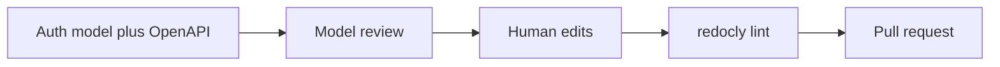

---
seo:
 title: Use AI to check authentication and authorization patterns
 description: Spot missing scopes, inconsistent security schemes, and thin auth error docs in OpenAPI with a model, then enforce fixes with Redocly CLI lint before merge.
---

# Use AI to check authentication and authorization patterns

You can ask a model to read your OpenAPI security model before handlers ship, then run the same file through Redocly CLI lint in the pull request. The learn article [Use AI to accelerate and improve reviews](https://redocly.com/learn/ai-for-docs/ai-reviews) covers the wider review pattern; here the focus stays on schemes, scopes, route coverage, and the error contracts integrators need when credentials fail.

## Why auth and authorization drift in API descriptions

Teams add endpoints faster than they update `components.securitySchemes`. One route still documents API keys while the rest moved to OAuth2. Admin paths inherit a global bearer scheme but never list the scopes a caller needs. Documentation mentions 401 and 403 in prose while the spec only declares a generic 400.

A model can compare many paths at once and ask whether each operation matches the story you tell about roles and trust boundaries. It does not replace threat modeling, but it gives you a patient reader for long YAML.

## Inputs that keep the review grounded

Paste a short auth model in plain language before the spec excerpt. Name actors (for example integrators, support staff, machine clients), which routes are public, and which actions require elevated roles.

List invariants you already enforce in code, such as tenant isolation on every read, or that destructive verbs always require an admin scope. If the file is large, scope the excerpt to the surface you are changing and describe the rest in a sentence.

### Auth context block you can paste

```markdown 
Auth model: OAuth2 client credentials for integrators; session cookies for the dashboard.
Public: GET /status, GET /openapi.json
Roles: reader (read-only), admin (write + delete)

Review securitySchemes, security requirements, and auth-related responses:
[paste OpenAPI excerpt]
```

## Prompt skeleton for auth and authorization

Keep the ask structured so findings are easy to triage.

```markdown 
You are reviewing authentication and authorization for [one sentence domain].

Please list:
1. Operations that should require credentials but have no security requirement.
2. Mismatches between security scheme names in operations and components.securitySchemes.
3. Missing or inconsistent OAuth scopes (or permissions) across related endpoints.
4. Operations that share a scheme but should differ by role or scope.
5. Missing or vague 401 and 403 responses, including whether examples match the scheme.
6. Public routes that should explicitly document security: [] if they are intentionally open.

[paste OpenAPI or notes]
```

## Signals models often surface

Across teams, reviews tend to cluster on a short set of themes. Orphan schemes appear when `components.securitySchemes` defines a name operations never reference. Scope gaps show up when write endpoints document fewer scopes than read endpoints on the same resource. Error gaps cluster when only 200 responses are declared, or when 401 and 403 reuse the same schema without explaining retry versus forbidden. Inheritance confusion happens when a global `security` block hides which routes are actually public.

Treat the list as a prioritized backlog, not a verdict. Some routes are intentionally open, and some schemes are legacy until a migration finishes.

## Thin before and after on security

Before:

```yaml 
paths:
  /reports:
    get:
      summary: Download usage report
      security:
        - bearerAuth: []
components:
  securitySchemes:
    BearerAuth:
      type: http
      scheme: bearer
```

After:

```yaml 
paths:
  /reports:
    get:
      summary: Download usage report
      security:
        - BearerAuth: [reports:read]
      responses:
        '401':
          description: Missing or invalid bearer token
        '403':
          description: Caller lacks reports:read scope
components:
  securitySchemes:
    BearerAuth:
      type: http
      scheme: bearer
      bearerFormat: JWT
```

The second sketch does not prove your threat model is complete, but it shows how a review nudges you toward aligned names, explicit scopes, and distinct failure responses before implementation hardens the wrong shape.



Run the loop while the document is still cheap to edit.

## Where CLI lint takes over

When you accept changes, run the [lint command](https://redocly.com/docs/cli/commands/lint) against the same file the model saw. Lint applies preprocessors and rules, reports problems in OpenAPI and related formats, and does not run decorators, which keeps this step focused on spec compliance rather than publishing transforms.

The [built-in rules](https://redocly.com/docs/cli/rules/built-in-rules) catalog includes security-related checks. The [security-defined rule](https://redocly.com/docs/cli/rules/oas/security-defined) verifies that every operation or global security requirement is defined. If an API is intentionally public, the rule documentation shows declaring an empty requirement so readers know the omission is deliberate:

```yaml 
security: []
```

In continuous integration, point the same command at pull requests so every spec edit repeats local checks. Models sometimes suggest scheme names or extensions your ruleset has not whitelisted yet, and lint surfaces those mismatches early.

If you have no local config yet, the command defaults to the [recommended ruleset](https://redocly.com/docs/cli/rules/recommended). As standards mature, add [configurable rules](https://redocly.com/docs/cli/rules/configurable-rules) for org-specific auth policies, such as requiring scope text in operation descriptions or forbidding duplicate scheme types on one path. The [guide to configuring a ruleset](https://redocly.com/docs/cli/guides/configure-rules) walks through a practical baseline.

Organizations that treat OpenAPI as law usually centralize how rules are authored and shared. The [API standards and governance](https://redocly.com/docs/cli/api-standards) page describes using the same configuration locally and in automation so developers see the same violations everywhere.

## Best practices

Ship the auth model as a short checklist, not a long policy essay, in the same message as the spec excerpt.

Review one theme at a time on large files: scheme names first, then scopes, then error responses.

Log model findings as tickets with path and operation anchors so humans can accept or reject with traceability.

Combine model passes with deterministic tools so subjective completeness meets objective gates, which mirrors the guidance in [Use AI to accelerate and improve reviews](https://redocly.com/learn/ai-for-docs/ai-reviews).

## What this pairing cannot replace

Models do not know your live identity provider configuration, token lifetimes, or penetration test results unless you state them. They can suggest scopes that sound reasonable but do not match what your authorization service enforces. Lint cannot judge whether a scope is too broad for a role; it checks that the document obeys the rules you configured.

## Summary

Use a structured prompt plus a plain-language auth model to surface scheme, scope, and error gaps early, then let Redocly CLI enforce the rules your team already agreed to. Keep humans in the loop for trade-offs, and treat automation as a safety net rather than a substitute for security review.

## Learn more

When you are ready to wire the deterministic side of the loop, start with [Explore Redocly CLI](https://redocly.com/docs/cli/) for installation, first commands, and how lint fits alongside bundling and preview workflows described in the broader [rulesets](https://redocly.com/docs/cli/rules) documentation.
