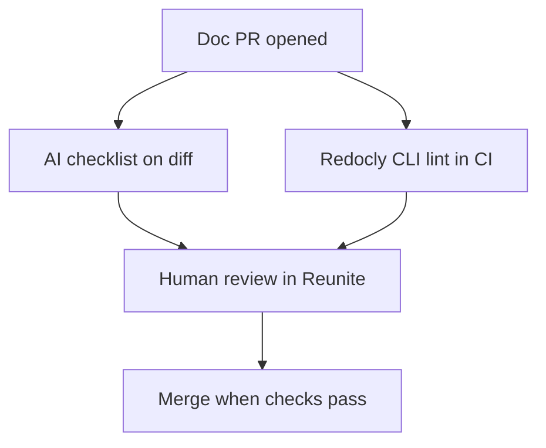

---
seo:
 title: Use AI to automate documentation reviews in your PR workflow
 description: How to wire AI checklist reviews into every doc pull request alongside Reunite previews and Redocly CLI lint so style, spec, and judgment stay in separate layers.
---

# Use AI to automate documentation reviews in your PR workflow

Doc teams rarely lack review intent. They lack a default moment when review happens. Changes slip through because nobody re-reads the changelog, the new tutorial page, and the OpenAPI diff in one sitting before merge. The practical fix is to automate review at the pull request boundary: every doc-related PR gets the same fast checks before a human spends attention.

This article shows how to combine an AI checklist pass on the diff, [Explore Redocly CLI](https://redocly.com/docs/cli/) lint in CI, and human approval in [Reunite](https://redocly.com/reunite) into three layers that do not compete for the same job.

## What to run on every documentation pull request

Scope automation to files the PR actually touches. Typical triggers include changelog entries, new or edited Markdown guides, navigation or sidebar edits, and OpenAPI files when the API surface changes.

Split the work by failure type. Style and clarity checks belong in an AI step that reads prose against a short checklist. Contract checks belong in the [lint command](https://redocly.com/docs/cli/commands/lint) against the spec. Strategic questions about whether a page should exist at all stay with human reviewers in [review a pull request in Reunite](https://redocly.com/docs/realm/reunite/project/pull-request/review-pull-request).

Keep each automated step under a few minutes on typical PRs. Long-running full-corpus reviews belong on a schedule, not on every push.

## Three layers: AI, CLI, humans

Think of the pipeline as three lanes that run in parallel where possible.

The AI lane applies a versioned checklist to added or changed text. It flags vague changelog lines, inconsistent heading case, or missing backticks on HTTP verbs. It posts line-level suggestions when your platform supports them.

The CLI lane runs [built-in rules](https://redocly.com/docs/cli/rules/built-in-rules) and your [guide to configuring a ruleset](https://redocly.com/docs/cli/guides/configure-rules) against OpenAPI and any Markdown rules you encoded under [API standards and governance](https://redocly.com/docs/cli/api-standards). Lint output should fail the check, not merely warn, for rules you treat as merge blockers.

The human lane uses Reunite visual diffs and threaded comments for judgment calls: Is this tutorial in the right place? Does marketing need to sign off? Does the example match behavior QA verified this week?

None of these lanes replaces the others. AI is fast on prose patterns; lint is deterministic on schema shape; humans own context you did not paste into the prompt.

## Redocly changelog reviews as a template

[Use AI to accelerate and improve reviews](https://redocly.com/learn/ai-for-docs/ai-reviews) documents an internal flow you can mirror without copying our exact checklist. An author adds a changelog entry in the pull request. An automated step compares that entry to a short checklist and the surrounding PR context. If the entry passes, the bot confirms it. If not, it posts a suggested rewrite with a brief explanation before a human opens the diff.

The before state is vague: "Fixed bug in API." The after state names the subsystem and symptom: authentication timeout in the OAuth2 flow when refresh tokens exceed the sixty-minute expiration window. That specificity is what you want every doc PR bot to enforce when changelog quality matters for release notes readers.

Store the checklist in Git next to the docs so policy changes are reviewable like code. Point the bot at that file on every run so authors and automation share one source of truth.

## How to wire the AI step in Git

Pass the PR diff, the checklist file path, and explicit output rules. Ask for a table with file, rule id, quoted text, and suggested fix. Require a pass marker when no listed rule fails, even if the prose could be prettier elsewhere.

Limit input tokens by scoping to changed hunks, not the entire repository. Post results as a check comment or review comment so authors see evidence beside the line.

Avoid open-ended "improve this page" prompts on every commit. They rewrite voice and swamp reviewers with subjective edits. One checklist pass per push event is easier to trust than a roaming editor.

For OpenAPI-only PRs, a separate prompt can ask for gap and consistency review as described in the same learn article, but keep that job separate from changelog style so failures are easy to route.

## Where Reunite fits in the same workflow

[Reunite](https://redocly.com/reunite) connects documentation work to Git branches, commits, and pull requests whether you use Redocly-hosted Git or an external provider. Authors [open a pull request in Reunite](https://redocly.com/docs/realm/reunite/project/pull-request/open-pull-request), invite reviewers, and use visual before-and-after previews on the Review tab so approvers see rendered pages, not only raw Markdown.

Automated AI and lint checks should finish before you ask for human review, or at least post their status on the PR so reviewers know what is already clean. The [Reunite documentation](https://redocly.com/docs/realm/reunite/reunite) hub links editor, deployment, and PR tasks in one place.

Treat Reunite as the conversation surface after machines narrow the diff. Bots surface checklist violations; humans decide what to merge.

## Run Redocly CLI lint on the same pull request

Add a CI job that runs `redocly lint` on the spec paths your repo owns. The post [consistent APIs with Redocly and GitHub Actions](https://redocly.com/blog/consistent-apis-redocly-github-actions) walks through wiring lint into GitHub Actions with annotations on the files authors changed.

Use `--format=github-actions` or your platform equivalent so failures appear inline. Run lint on the same commit the AI step read so prose and schema feedback refer to one revision.

When the model spots the same spec mistake repeatedly, promote it to a configurable lint rule so the next PR fails before the bot runs.

## What automated review cannot decide

Bots cannot know your unpublished roadmap, legal hold language, or whether a tutorial should be split for accessibility. They should not be the only reviewer on safety-critical runbooks.

AI steps also drift if the checklist rots. Assign an owner to update the checklist when terminology changes, the same way you update lint rules.

## Best practices

1. Version the checklist and rulesets in Git and reference them by path in bot configuration.
2. Fail CI on lint errors you classify as blockers; keep AI output as suggestions until the checklist stabilizes.
3. Scope automated prose review to changed files in the PR to keep latency predictable.
4. Log false positives monthly and tune the checklist before you change models.

## What this approach cannot replace

This approach cannot replace editorial ownership, localization review, or security review of credential examples. It makes doc PRs predictable: machines enforce what you wrote down, humans decide what you did not.

## How the pieces fit together

Each pull request triggers parallel machine lanes, then human approval on a narrowed diff.

## Learn more

When you want Git-backed docs, previews, and pull request review in one product surface, start with [Reunite](https://redocly.com/reunite) and the [Reunite documentation](https://redocly.com/docs/realm/reunite/reunite) hub for editor and PR workflows.

Add [Explore Redocly CLI](https://redocly.com/docs/cli/) with the [lint command](https://redocly.com/docs/cli/commands/lint) and [API standards and governance](https://redocly.com/docs/cli/api-standards) when you want the same spec rules on every PR in CI.
