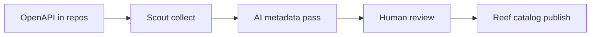

---
seo:
 title: Use AI to build a searchable API catalog for your team
 description: Enrich API metadata with AI at scale and publish a searchable Reef catalog your developers can browse or query in natural language.
---

# Use AI to build a searchable API catalog for your team

A spreadsheet of service names is not a catalog. Developers need descriptions, owners, tags, and stable links they can search. You can use AI to enrich metadata across many OpenAPI files, then publish the result in Reef so the catalog stays current as specs change. That workflow extends the AI plus validation pattern in [How AI fits into modern API documentation](https://redocly.com/learn/ai-for-docs/ai-modern-api-docs).

## Lists versus catalogs

A list answers what is deployed. A catalog answers what it does, who owns it, and how to call it safely. Search fails when titles are opaque (`internal-svc-7`) or when the same product has three names across repos. Metadata is the difference between findability and guesswork.

Think of search as matching intent to records. Intent might be I need to refund a subscription or Which API owns webhooks. Without summaries and tags, search falls back to filename guessing. A catalog row should read like a helpful librarian card, not like an infrastructure ticket title.

## Metadata AI can enrich safely

Models are strong at drafting short descriptions from paths and schemas, proposing tags from domain language, and normalizing display names when you supply a style note. They are weak at inventing owners or SLAs. Paste real ownership from your service registry when you have it, and ask the model only to format or shorten.

Fields worth enriching in bulk:

- Human-readable summary (one to two sentences)
- Domain tags (`payments`, `identity`)
- Lifecycle stage (`experimental`, `stable`, `deprecated`)
- Links to primary OpenAPI file and runbooks

Add a contact or team channel when your service catalog already stores it. Search results that end in a dead end teach developers to ignore the catalog.

## Prompt skeleton for bulk enrichment

```markdown 
You are enriching API catalog metadata for internal developers.

Rules:
- Do not invent owners or on-call handles; leave blank if missing.
- Use sentence case for titles.
- Keep summaries under 40 words.

For each API row below, return JSON with: title, summary, tags, lifecycle.

[paste table of api_id, path_prefix, openapi_excerpt, owner_if_known]
```

Review JSON in a pull request like any other generated content.

## Before and after on catalog fields

Before:

```yaml 
title: orders-svc
description: ""
```

After:

```yaml 
title: Orders API
description: Create and track customer orders for the retail storefront.
tags: [orders, commerce]
lifecycle: stable
```

The after block still needs a human to confirm accuracy against the live service.

## Ingest, enrich, and publish

Collect specs with [Scout documentation](https://redocly.com/docs/realm/scout) and [What is Scout?](https://redocly.com/docs/realm/scout/what-is-scout) so enrichment starts from files in git, not from stale exports. Configure how APIs appear in the portal using [API catalog configuration](https://redocly.com/docs/realm/config/catalog-classic). Tune findability with [Search configuration](https://redocly.com/docs/realm/config/search) once metadata lands.



Re-run enrichment when major paths change, not on every typo fix.

## Search and natural-language questions

Structured search uses tags and titles. Natural-language questions work better when summaries mention tasks (`refund a subscription`) not only resource names. The [API catalogs for agentic software](https://redocly.com/blog/api-catalogs-agentic-software) post describes why rich metadata helps both people and agents choose the right API on the first try.

You do not need a custom chatbot on day one. Start with faceted search by tag and owner, then add assistant features when metadata quality is stable. If answers cite the wrong API, fix the catalog row before tuning the model. Garbage in still produces confident wrong answers.

### Questions to test after publish

Ask five colleagues to find an API without Slack help:

1. How do I create a webhook for billing events?
2. Which API owns user invitations?
3. Where is the sandbox base URL documented?
4. What is deprecated in payments this quarter?
5. Who owns the identity service on call?

Misses become metadata tickets, not one-off doc edits buried in a random repo.

### Checklist before you turn on broad search

- Every catalog entry links to a canonical OpenAPI file
- Deprecated APIs are labeled and point to replacements
- Owners or team channels are present for stable APIs
- Sensitive internal-only APIs are flagged in metadata

## Best practices

Batch enrich by domain so reviewers stay in context.

Keep a banned-phrase list (internal codenames) in the prompt.

Diff enriched YAML in CI so drift is visible.

Pair catalog updates with Scout collection schedules.

Assign a metadata owner per domain who approves AI suggestions weekly.

Store enrichment prompts in git next to the glossary so changes are reviewable.

When an API ships, block merge unless catalog metadata updates in the same pull request as the OpenAPI change.

## Limits of generated metadata

Generated text can misstate behavior if the spec is thin. Models may over-tag APIs when prompts are vague. Search quality still depends on engineers maintaining specs after enrichment.

If your organization also runs API design reviews, feed catalog gaps back into those reviews. A missing description in the catalog often means the OpenAPI `summary` was empty when the service shipped. Fixing upstream specs keeps AI enrichment from repeating the same blank template every quarter.

## Summary

Treat catalog metadata as a product: collect specs, enrich with grounded AI, review in git, and publish in Reef with search tuned for how your developers ask questions. Revisit catalog quality when teams complain they cannot find an API, not only when Scout adds new repositories.

## Learn more

[Reef](https://redocly.com/reef) hosts the searchable catalog and Scout collection so enriched metadata stays tied to the repositories your teams already maintain.
