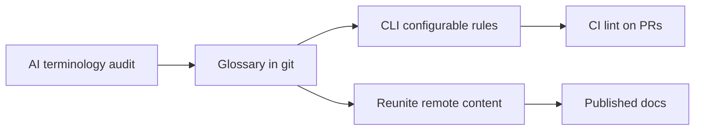

---
seo:
 title: Use AI to check terminology consistency across your docs
 description: Audit docs for conflicting terms with AI, encode a canonical glossary in Redocly CLI lint rules, and single-source definitions with Reunite remote content.
---

# Use AI to check terminology consistency across your docs

The same product becomes an account, a tenant, and an organization in different guides. Readers notice, and linters do not catch prose drift by default. You can run an AI terminology audit, agree on a canonical glossary, encode forbidden variants in Redocly CLI rules, and host shared definitions with Reunite remote content. The review rhythm matches [Use AI to accelerate and improve reviews](https://redocly.com/learn/ai-for-docs/ai-reviews), but the checklist here focuses on language rather than API shape.

## How the same concept gets three names

Teams write docs in parallel. Marketing prefers customer-friendly words while reference docs keep engineer shorthand. Acquisitions import whole doc sets with their own nouns. Without a glossary, every writer makes a reasonable local choice and the corpus diverges.

Terminology drift also shows up inside OpenAPI `description` fields, error messages rendered in docs, and UI strings pasted into guides. An audit that scans only marketing pages will miss conflicts sitting next to schema tables. Include both prose pages and spec excerpts in the first pass.

## AI audit prompt for terminology

Paste excerpts or file paths with a short domain note. Ask for conflicts, not rewrites, in the first pass.

```markdown 
You are auditing documentation terminology for [product domain].

Canonical terms we prefer:
- organization (not tenant, not account) for B2B workspaces
- member (not user) for people inside an organization

Scan the excerpts below and return a table:
| term_used | preferred_term | file_or_section | severity |

Do not rewrite prose yet.

[paste markdown excerpts]
```

Severity helps writers triage before you open a hundred tickets.

## Building a canonical glossary

Convert the audit table into a one-page glossary with definition, allowed synonyms, and forbidden variants. Store it in git. Link it from your contributor guide. Keep entries short so writers actually read them.

Example entry:

```markdown 
## organization
Definition: A B2B customer workspace that owns subscriptions.
Use: organization
Avoid: tenant, account (unless referring to billing account)
```

## Encoding terms as CLI rules

Subjective audits do not scale in CI. After humans agree on terms, express checks with [configurable rules](https://redocly.com/docs/cli/rules/configurable-rules) in your ruleset. Start from the [recommended ruleset](https://redocly.com/docs/cli/rules/recommended) and extend. Run the [lint command](https://redocly.com/docs/cli/commands/lint) on pull requests that touch docs or OpenAPI descriptions so violations fail before merge.

Configurable rules work well for description fields and summary strings where the same forbidden token should never appear. They cannot understand context-heavy cases (`account` in a banking doc may be correct). Keep a short exception list in the rule comments.

The [guide to configuring a ruleset](https://redocly.com/docs/cli/guides/configure-rules) walks through first-time setup if your repository has no `redocly.yaml` yet.

### Example policy you can express

| Forbidden in summaries | Preferred | Notes |
|------------------------|-----------|-------|
| tenant | organization | B2B workspace |
| user | member | people inside an org |
| webhook URL | webhook endpoint | align with UI copy |

Start with three to five high-impact swaps. Expand after false positives are understood.



Remote content keeps definitions synchronized with the glossary file.

## Reunite remote content for single sourcing

When a term appears in fifty pages, editing each file by hand fails. [Remote content](https://redocly.com/docs/realm/reunite/project/remote-content/remote-content) lets Reunite pull shared snippets from a canonical repository. Writers edit the glossary fragment once; pages include it by reference. Onboard authors with [start with the Reunite editor](https://redocly.com/docs/realm/get-started/start-reunite-editor) and point them at [Reunite](https://redocly.com/reunite) for the wider workflow.

Use remote content for definitions and boilerplate, not for entire guides, so diffs stay readable.

Version the glossary file with semver or dates in the filename when terms change often. Remote content consumers should pin to a tag until they update references deliberately.

## Best practices

Run terminology audits after rebrands or major UI copy changes.

Separate audit (find conflicts) from rewrite (fix prose) into two PR types.

Pair CLI bans with positive examples in the glossary.

Review false positives monthly and narrow rules instead of disabling lint.

Invite support and developer relations to the glossary review so customer-facing language matches docs.

Publish the glossary URL in your pull request template checklist for doc authors.

When remote content updates a definition, run lint on consuming projects the same day.

Export audit tables to CSV so product and support can comment without learning git syntax.

## What lint cannot catch

Rules excel at forbidden tokens in machine-readable fields. They struggle with ambiguous sentences where both terms are valid in context. AI audits can over-report colloquial phrases that stakeholders want to keep. Legal and brand still own trademark capitalization.

For narrative docs outside OpenAPI, run a lighter periodic AI audit even when CLI rules pass. Markdown guides can still mix customer and member in the same paragraph. Schedule that pass after major releases when new screenshots import fresh UI strings.

## Summary

Use AI to surface terminology drift, publish a short canonical glossary, enforce agreed bans with Redocly CLI in CI, and single-source definitions through Reunite remote content so the next writer does not reintroduce a third name for the same thing. Treat terminology like API versioning: visible, owned, and reviewed on a schedule.

## Learn more

[Explore Redocly CLI](https://redocly.com/docs/cli/) to wire configurable terminology rules into the same lint workflow you already use for OpenAPI validation.
