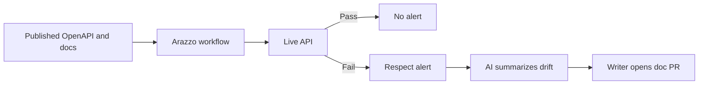

---
seo:
 title: Use AI to detect drift between your docs and your live API
 description: Use Respect scheduled Arazzo workflows to catch live API drift, then use AI to interpret alerts and draft doc updates your team can review.
---

# Use AI to detect drift between your docs and your live API

Your OpenAPI file and your developer portal can be perfect on merge day and still lie to customers two sprints later when an engineer ships a new status code, renames a field, or changes pagination defaults without updating prose. Drift is a timing problem. Respect gives you scheduled truth checks against live endpoints; AI helps you turn alerts into readable doc diffs your writers can accept or reject.

## Why docs fall behind production

Teams optimize for shipping features, not synchronizing every paragraph with deployment trains. Spec-first shops still skip tutorial updates. Doc-first shops still miss sandbox-only behavior. Even strong lint in CI only validates files in Git, not what runs behind the load balancer tonight.

Drift shows up as support tickets ("your sample returns 404"), failed customer scripts, and AI agents that confidently cite outdated examples. You need monitoring that compares behavior to the contract you publish, plus a human-readable path from failure to doc fix.

## Catch behavioral drift with Respect

[Respect](https://redocly.com/respect) runs API workflows described in Arazzo against real environments. You define steps such as obtain token, create resource, list with pagination, and assert status codes and JSON shapes. Schedule those workflows against staging and production, and route failures to Slack or email the way you route test failures.

[Respect use cases](https://redocly.com/docs/respect/use-cases) cover contract testing in pull requests and ongoing monitoring after deploy. The same workflow file can gate a release in CI and run hourly to detect silent regressions.



[Documenting multiple APIs using Arazzo](https://redocly.com/learn/arazzo/documenting-multiple-apis-using-arazzo) explains how to model multi-step flows that lint alone cannot express. When a Respect step expects page[size] but production now expects pageSize, you have a concrete diff to chase in reference and guides.

## Sample alert and what to record

A useful alert bundles environment, step name, expected assertion, actual response snippet, and workflow version. Avoid screenshots alone; writers need copyable JSON.

Example alert body (illustrative):

```text
Workflow: signup-smoke
Step: list-orders page 2
Expected: 200 with body.links.next
Actual: 200 with body.pagination.nextCursor
Environment: production-eu
```

Store alerts in your ticket system with labels docs-drift and api-drift so teams know whether to fix code, spec, or prose first.

## Use AI to interpret alerts and draft updates

AI does not replace Respect assertions. It accelerates triage: classify whether the spec, implementation, or documentation is wrong, then propose edits grounded in artifacts you paste.

```markdown 
You are helping a technical writer fix documentation drift.

Inputs:
1. Respect alert (below)
2. Excerpt from current OpenAPI for the affected operation
3. Excerpt from current doc page

Tasks:
- State the most likely source of drift (spec, implementation, docs)
- List doc sentences that are now false
- Propose revised paragraphs and example JSON
- Flag if OpenAPI must change before docs

Do not invent endpoints. If uncertain, ask one clarifying question.

Alert:
[paste]

OpenAPI:
[paste]

Docs:
[paste]
```

Review output like any generated draft. If production is wrong, fix the service and add Respect coverage so the bug cannot return quietly. If production is right, update OpenAPI first when your portal is spec-driven, then refresh tutorials.

## Alert-to-fix workflow your team can adopt

1. Respect fails on schedule; on-call acknowledges within SLA.
2. Owner pastes alert, spec slice, and doc slice into the prompt above.
3. Writer opens a pull request with doc changes; API owner opens a parallel change if schema changed.
4. Merge after [lint command](https://redocly.com/docs/cli/commands/lint) passes on the updated spec and a repeat Respect run is green.
5. Add a one-line changelog entry for external developers when behavior visible to customers changed.

[API contract testing with Arazzo](https://redocly.com/blog/api-contract-testing-arazzo) describes how teams wire similar flows into CI; the same files reduce drift between "works in staging PR" and "works Tuesday night in prod."

## Keep docs and spec in the same change train

When Respect fails, resist fixing only the portal copy while the OpenAPI file stays stale. Generated reference from Redoc and similar tools will overwrite manual edits on the next build. Treat the spec as the contract your customers export, update it first when production behavior is correct, then refresh guides and task-based examples that [Use AI as a usability tester](https://redocly.com/learn/ai-for-docs/ai-usability-testing) exercises in your smoke suite.

For teams comparing monitoring approaches, [tools for API testing in 2025](https://redocly.com/learn/testing/tools-for-api-testing-in-2025) summarizes how contract tests, sandboxes, and observability fit together; Respect slots into the contract and monitoring lane rather than replacing exploratory QA.

## Best practices

Version Arazzo workflows in Git beside the OpenAPI they exercise.

Test sandboxes and production separately; drift messages differ when only one region changed.

Keep example payloads in docs generated from fixtures Respect already asserts when possible.

When AI proposes doc fixes, require citations to alert lines so reviewers see the evidence chain.

## What AI cannot verify alone

Models do not execute HTTP requests in your VPC unless you give them tools to do so. They may rationalize a wrong field name if the alert is incomplete. Respect remains the source of behavioral truth; AI is editorial acceleration on top.

## Summary

Schedule Respect workflows against live APIs to detect drift early, capture alerts with enough detail to reproduce failures, and use AI to draft spec and doc updates humans merge with normal review. The goal is not fewer alerts; it is shorter time from alert to accurate public docs.

## Learn more

To run scheduled Arazzo workflows, monitor live endpoints, and get notified when behavior diverges from your spec, start with [Explore Respect](https://redocly.com/respect) and [Respect use cases](https://redocly.com/docs/respect/use-cases).
