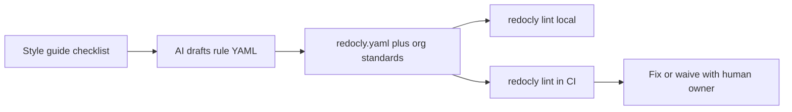

---
seo:
 title: Use AI to enforce your API style guide at scale
 description: How to turn a prose API style guide into Redocly CLI lint rules, run them across many OpenAPI files, and handle cases where AI suggestions and deterministic rules disagree.
---

# Use AI to enforce your API style guide at scale

A long wiki style guide does not stop the next team from shipping inconsistent operationId values across dozens of services, so you need prose for intent and lint rules for pass-or-fail checks, with AI bridging the gap to a redocly.yaml ruleset you run on every OpenAPI file in CI. This article shows how to condense your guide into a checklist, draft configurable rules with a model, scale enforcement with Redocly CLI, and keep human judgment where automation and the model disagree.

## Why a style guide and lint rules serve different jobs

Your style guide answers why and when. It covers naming philosophy, error shape preferences, and when to break a pattern for backward compatibility. Readers learn judgment from examples and narrative.

Lint rules answer whether this file violated a stated rule right now. They run the same way on every pull request, across hundreds of paths, without re-reading a PDF. [API standards and governance](https://redocly.com/docs/cli/api-standards) describes how [Explore Redocly CLI](https://redocly.com/docs/cli/) applies those checks locally and in continuous integration with one shared configuration.

If you only publish prose, standards drift as headcount grows. If you only ship lint without a readable guide, authors fix red squiggles without understanding the design goal. Keep both artifacts linked: each configurable rule should trace back to a checklist line your guide already explains.

## Condense prose into a checklist first

[Use AI to accelerate and improve reviews](https://redocly.com/learn/ai-for-docs/ai-reviews) makes the same point for documentation style: a one-page checklist beats a fifty-page manual for consistent review. Apply that shape to API design rules before you ask a model to write YAML.

Replace paragraphs like "operation identifiers should be clear and consistent" with inspectable lines:

```markdown 
- [ ] Every operation has an operationId
- [ ] operationId uses camelCase
- [ ] Path parameters use snake_case in the spec
- [ ] Every operation declares security when the API uses OAuth2
- [ ] Error responses include a machine-readable code field
```

If your organization is still debating standards, the [API guidelines builder](https://redocly.com/api-governance) and the post on [build your own API guidelines](https://redocly.com/blog/build-your-own-api-guidelines) recommend answering only the questions that matter now and expanding the ruleset later. A short checklist is easier for AI to map to assertions than an unfocused workshop output.

## Prompt AI to draft Redocly CLI rules

Give the model three inputs: the checklist, one representative OpenAPI excerpt that currently fails a few lines, and the Redocly [configurable rules](https://redocly.com/docs/cli/rules/configurable-rules) shape (subject, assertions, severity). Ask for output as a rules block only, with one rule name prefixed with rule/ per checklist item that can be expressed as an assertion.

```markdown 
You are translating an API style checklist into Redocly CLI configurable rules.

Checklist:
[paste checklist]

Example OpenAPI excerpt with known violations:
[paste yaml]

For each checklist item that can be checked deterministically on an OpenAPI node:
1. Propose a rule name prefixed with rule/
2. Set subject type and property
3. Choose assertions (casing, defined, pattern, enum, nonEmpty)
4. Set severity: error for merge blockers, warn for gradual adoption
5. Skip items that require human judgment and list them under manual_only

Return valid YAML for the rules section only.
```

Review the draft like any generated code. AI may overfit to the sample file or set severity too aggressively for legacy APIs. Treat the output as a first pull request, not production config.

## Before and after: one prose rule becomes YAML

Prose rule: Operation IDs must use camelCase so generated SDK methods read naturally.

Configurable rule the model might propose:

```yaml 
rules:
  rule/operationId-camelCase:
    subject:
      type: Operation
      property: operationId
    assertions:
      casing: camelCase
    message: operationId must use camelCase per API style guide section 4.2
    severity: error
```

Lint output on a violating spec surfaces the same line every time, which is what scale requires. Authors click from CI annotation to the rule name, then to the guide section cited in message.

For rules already covered by [built-in rules](https://redocly.com/docs/cli/rules/built-in-rules), prefer extending the [recommended ruleset](https://redocly.com/docs/cli/rules/recommended) and toggling severity instead of duplicating logic. Reserve configurable rules for standards specific to your organization.

## Run the ruleset across many APIs

Start from a shared redocly.yaml at the repo root or in a dedicated standards repository. The [guide to configuring a ruleset](https://redocly.com/docs/cli/guides/configure-rules) shows how extends pulls in recommended, then your custom YAML, then per-rule overrides.

```yaml 
extends:
  - recommended
  - ./org-api-standards.yaml

rules:
  security-defined: warn
```

Publish org-api-standards.yaml as a reusable package so many microservices import the same file version. Use the apis block when one legacy surface needs looser rules while new APIs stay strict: point each API root at its OpenAPI file and override only the rules that differ.

Wire [lint command](https://redocly.com/docs/cli/commands/lint) into CI on every OpenAPI path you own. Local runs before push catch the same failures developers see in the pipeline. When the model flags a recurring violation in review but lint stays green, that is a signal to promote the checklist line into a new rule entry.



The flow keeps prose standards, generated rules, and deterministic enforcement in one loop you can repeat when the guide changes.

## When AI and lint disagree

Disagreement usually falls into three buckets.

Subjective clarity: the model says a description is vague; lint passes because description is non-empty. Keep that in AI-assisted review or an editorial checklist, not in redocly.yaml, unless you can write a tight pattern assertion without false positives.

Legacy exceptions: lint fails on an API you cannot change this quarter. Lower severity to warn for that API in the per-API block, or disable one rule with a tracked ticket. Do not delete the rule globally.

Overstrict generated rules: the model proposes pattern assertions that reject valid paths your guide allows. Humans trim the assertion or narrow the where clause. [Configurable rules](https://redocly.com/docs/cli/rules/configurable-rules) documentation covers optional where filters when the rule should apply only to certain operations.

Human judgment stays final for trade-offs the guide describes in prose. Lint owns what you encoded. AI helps you draft and refresh encoding when the guide evolves.

## Best practices

1. Version the checklist and redocly.yaml in Git; reference the same commit in AI prompts and CI.
2. Start with warn on new rules for brownfield APIs; promote to error when violation counts trend to zero.
3. Ask the model for a manual_only list so subjective standards do not become brittle patterns.
4. Re-run translation when the guide changes, the same way you update tests when requirements change.
5. Combine AI review for gaps and naming clarity with CLI lint for enforceable shape, as [Use AI to accelerate and improve reviews](https://redocly.com/learn/ai-for-docs/ai-reviews) recommends.

## What lint cannot replace

Lint cannot judge roadmap priority, legal wording in descriptions, or whether an endpoint should exist at all. It cannot verify that your examples match production behavior without separate contract tests. It will not fix an API team that never adopted the guide in the first place.

Use automation to make agreed standards unavoidable, workshops to reach agreement, and humans when the guide itself needs to change.

## The balance

A thin checklist, a reviewed redocly.yaml, and CI that runs the same rules on every service turns your style guide from shelfware into a default developers meet before merge.

## Learn more

To encode standards with built-in, configurable, and custom rules, tune severity per API, and run lint locally and in CI, start with [Explore Redocly CLI](https://redocly.com/docs/cli/) and [API standards and governance](https://redocly.com/docs/cli/api-standards).
