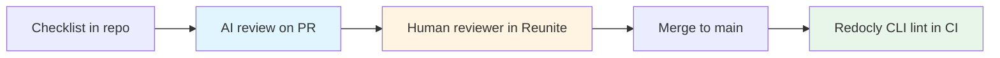

---
seo:
 title: Use AI to enforce tone and style consistency across docs
 description: How tone drifts across authors, why a one-page checklist beats a style manual for LLM reviews, and how Reunite pull requests plus Redocly CLI rules keep prose aligned before merge.
---

# Use AI to enforce tone and style consistency across docs

Documentation sets rarely fail because nobody cares about tone. They fail because ten caring people each wrote a page under pressure and nobody had time to re-read the whole corpus before release. A large language model can scan many files for the same handful of rules in minutes.

It will still miss strategy and brand nuance if you hand it a fifty-page style guide. The practical pairing is a short checklist in the prompt, a Git pull request in [Reunite](https://redocly.com/reunite) so every change gets a diff and a preview, and [Explore Redocly CLI](https://redocly.com/docs/cli/) rules for anything you can state as a repeatable pattern.

This article follows the catalog scope: why drift happens, how to brief AI with a condensed checklist, a concrete internal changelog workflow you can read on our learn site, and how to wire reviews into PRs.

## Why tone drifts even when the team agrees on standards

Contributors ship under different deadlines, copy from older pages that predate the latest terminology, and inherit templates that never matched the style guide. Editors also optimize for clarity in isolation, which produces perfectly good sentences that still read like five products in one handbook.

Drift is a coordination problem more than a motivation problem. You need a lightweight signal on every change, not a quarterly read-through that arrives too late.

## Give the model a checklist, not a prose style guide

Long manuals dilute attention for humans and for models alike. The learn article [Use AI to accelerate and improve reviews](https://redocly.com/learn/ai-for-docs/ai-reviews) argues that a one-page checklist outperforms multi-page prose rules because each line is actionable in a single pass.

Translate your house style into ten to fifteen binary checks. Examples include present tense for shipped behavior, second person for procedural steps, code literals in backticks, banned hedge words, and heading case rules. Paste that list above the Markdown you want reviewed, then ask for a table with columns for file path, rule id, quote of the offending text, and a concrete rewrite.

Ask the model to return "pass" when a section violates no listed rule, even if it could be prettier. That reduces noise from subjective taste that belongs in human review.

## A real example: changelog entries before merge

The same learn article documents how Redocly treats changelog PRs. The flow stays small on purpose. The author writes the entry, an automated review compares it to a short internal checklist and the surrounding PR context, and the bot either confirms the entry or posts a suggested rewrite with an explanation before a human spends time on it.

You can reuse that shape without copying our exact checklist. What matters is that the model receives the diff, the checklist, and permission to quote lines directly so reviewers see evidence, not vibes.

## How Reunite turns reviews into a default step in Git

[Reunite](https://redocly.com/reunite) is built around Git-backed projects, an editor, and the social mechanics of review. The docs hub under [Reunite documentation](https://redocly.com/docs/realm/reunite/reunite) links to tasks such as [Get started with the Reunite editor](https://redocly.com/docs/realm/get-started/start-reunite-editor) and [Open a pull request in Reunite](https://redocly.com/docs/realm/reunite/project/pull-request/open-pull-request).

Those pages are where previews and threaded comments belong before merge.

Put the checklist in your PR template or bot comment so authors see it before they ask for review. Keep the AI step fast: one checklist pass per commit is easier to trust than an open-ended prompt that rewrites whole files.

## Where Redocly CLI still matters

Some style rules are subjective, but others are mechanical once you write them down: forbidden terminology, required front matter keys, links that must stay relative, or headings that must match a pattern. Those belong in [API standards and governance](https://redocly.com/docs/cli/api-standards) as lint, not as model judgment.

Use the [guide to configuring a ruleset](https://redocly.com/docs/cli/guides/configure-rules), extend [built-in rules](https://redocly.com/docs/cli/rules/built-in-rules) where they already fit, and add [configurable rules](https://redocly.com/docs/cli/rules/configurable-rules) when you need assertions on headings, metadata, or repeated phrases. The model can propose new rules after it spots the same mistake three times in one month. Engineers encode the rule so the fourth time never ships.

## What AI cannot judge

Models cannot decide whether a feature name should align with marketing for the next launch, whether legal needs to approve a sentence, or whether a tutorial should be split for accessibility. They also should not be the only reviewer on safety-critical instructions.

Use AI to enforce the checklist you already agreed as a team. Use humans for trade-offs, narrative arc, and anything that depends on roadmap context you did not paste into the prompt.

## Best practices

1. Version the checklist in Git next to the docs so changes to tone policy are reviewable like code.
2. Scope each automated pass to the files touched in the PR so latency stays low and suggestions stay local.
3. Log false positives and tune the checklist before you tune the model temperature.
4. Pair every AI comment with a human approval step until the checklist stabilizes.

## What this approach cannot replace

This approach cannot replace editorial ownership of narrative voice, localization review, or accessibility audits that require assistive technology. It reduces noisy inconsistency; it does not choose your brand story for you.

## How the pieces fit together

Checklists steer the model, Reunite carries the conversation on a real diff, and CLI lint keeps mechanical rules from regressing after merge.

## Learn more

When you want Git-backed writing, previews, and pull requests in one place, start with [Reunite](https://redocly.com/reunite) and the linked [Reunite documentation](https://redocly.com/docs/realm/reunite/reunite) for editor and PR tasks.

When you are ready to encode the rules that should never depend on model mood, add [Explore Redocly CLI](https://redocly.com/docs/cli/) with [API standards and governance](https://redocly.com/docs/cli/api-standards) and [configurable rules](https://redocly.com/docs/cli/rules/configurable-rules) so the same checks run locally and in CI.
