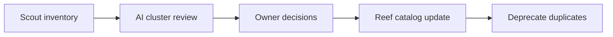

---
seo:
 title: Use AI to find duplicate and underused APIs in your codebase
 description: Combine Reef API Scout discovery with structured AI review to spot overlapping endpoints and low-use services before you consolidate.
---

# Use AI to find duplicate and underused APIs in your codebase

Large organizations often discover the same capability twice because teams ship in parallel. You can run a discovery audit that starts with inventory from Reef API Scout, then uses a model to group similar endpoints and flag APIs with weak ownership or usage signals. The pairing keeps facts grounded while AI handles pattern matching at scale, which matches the broader lifecycle in [How AI fits into modern API documentation](https://redocly.com/learn/ai-for-docs/ai-modern-api-docs).

## Why API sprawl shows up late

Microservices, acquisitions, and partner integrations all add routes. Without a catalog, duplicate payment or profile APIs can coexist for years. Underused services still incur security review and on-call load. The pain appears when a new team rebuilds something that already exists, or when compliance asks for a complete API list you cannot produce quickly.

Sprawl is rarely malicious. Two product lines may both need a customer record, so each ships a `/customers` surface with slightly different fields. A partner integration copies an internal spec and never syncs again. Platform teams inherit repos they did not author, so nobody feels safe deleting the older variant. Discovery work pays off when you can show overlap with evidence instead of asking teams to merge on faith alone.

## What Scout gives you before AI

[What is Scout?](https://redocly.com/docs/realm/scout/what-is-scout) describes how Redocly Scout collects API definitions from repositories so you are not guessing from memory. Deploy and operate collection using the [Scout documentation](https://redocly.com/docs/realm/scout) and review [Scout use cases](https://redocly.com/docs/realm/scout/use-cases) for common estate layouts. Scout answers which APIs exist and where their specs live. It does not by itself decide which duplicates to retire.

Treat Scout output as the allowlist for AI review. If a path never appears in inventory, the model should not invent it.

## Inputs for an AI-assisted duplicate review

Export or paste a table of services with path prefixes, OpenAPI titles, owners, and optional traffic or consumer counts when your platform provides them. Add business context in a short paragraph: which domains are strategic, which systems are legacy-only, and whether multiple versions are intentional.

> Example row: `payments-v2` POST `/charges` and `billing-legacy` POST `/payment/charges` both owned by different teams, last deploy 18 months apart.

## Prompt skeleton for overlap and usage signals

```markdown 
You are reviewing an API inventory for duplicate or underused APIs.

Given the table below:
1. Group endpoints that appear to implement the same capability (name the cluster).
2. Flag APIs with no clear owner or stale metadata.
3. Note version pairs that look like unmigrated duplicates.
4. List APIs that look underused based on the usage column (if present).
5. Suggest one consolidation question per cluster for human owners.

[paste inventory table]
```

Keep clusters small enough that owners can respond in one meeting.

## Signals models often surface

Models frequently cluster near-duplicate paths that differ only by prefix or verb choice. They also highlight parallel major versions when v1 and v2 both accept writes. Shadow APIs appear when OpenAPI exists in a repo but the service is not linked from any catalog entry. Underuse shows up when consumer counts are zero or when an API has rich spec text but no recent deploys. Treat every cluster as a hypothesis until owners confirm.

### Duplicate patterns worth naming in the prompt

Ask the model to label clusters so owners recognize the pattern quickly:

| Pattern | What it looks like | Typical owner action |
|---------|-------------------|----------------------|
| Twin resources | Two CRUD surfaces on the same noun | Pick one canonical API, deprecate the other |
| Version fork | v1 and v2 both writable | Freeze v1, document migration |
| Shadow spec | OpenAPI in git, no runtime owner | Archive or attach to a service |
| Dormant API | No consumers in telemetry | Sunset or merge into a shared platform API |

When telemetry is missing, say so in the prompt. The model should flag uncertainty instead of ranking APIs as unused without data.

## Turning findings into a consolidation backlog

Rank clusters by customer impact and operational cost, not by spec similarity alone. For each accepted duplicate, record the canonical API, the deprecation window, and the doc redirect plan. Publish the result in your catalog configuration so search surfaces the winner, as described in [API catalog configuration](https://redocly.com/docs/realm/config/catalog-classic). The [API catalogs for agentic software](https://redocly.com/blog/api-catalogs-agentic-software) article explains why a single searchable layer matters when both humans and agents consume your estate.



The loop runs quarterly or after major acquisitions, not only once.

## Best practices

Start from collected specs, not from chat memory about what exists.

Ask owners for one sentence on why two similar APIs both exist before you schedule decommission.

Track consumer migrations explicitly when you retire a duplicate.

Log model clusters with links to spec files so auditors can reproduce the review.

Share audit results in the same channel where architects already discuss standards, so consolidation does not feel like an surprise security review.

Time-box AI review to clusters under twenty APIs per pass. Larger batches produce vague groupings.

When you publish winners in the catalog, add a `deprecated` or `successor` field in metadata so search surfaces the replacement immediately.

## What discovery cannot replace

AI does not see private traffic dashboards unless you paste aggregates, and it cannot sign deprecation notices for partner APIs. Scout coverage is only as complete as the repositories you connect. Political ownership disputes still need human negotiation.

## Summary

Use Scout to inventory the estate, use structured AI passes to propose duplicate and underuse clusters, then let owners decide what to merge. Publish the canonical APIs in Reef so the next team finds one front door instead of three.

## Learn more

[Reef](https://redocly.com/reef) brings API Scout discovery and catalog publishing together so duplicate reviews turn into a maintained source of truth rather than a one-off spreadsheet.
