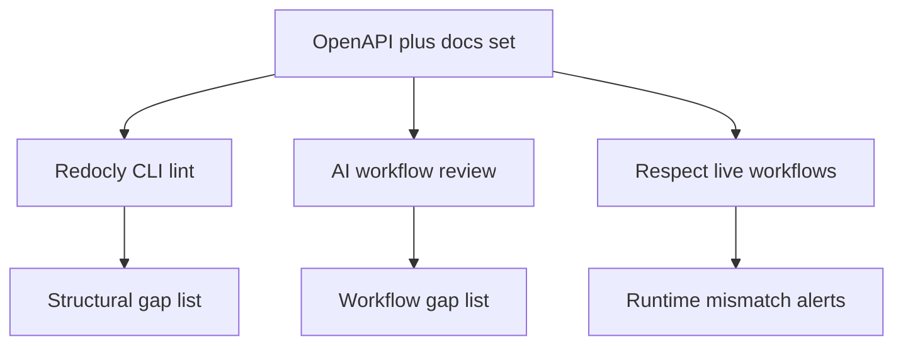

---
seo:
 title: Use AI to find gaps in your documentation coverage
 description: Use Redocly CLI lint for missing fields in specs and AI for missing workflows in prose, then use Respect monitoring for gaps that appear only at runtime.
---

# Use AI to find gaps in your documentation coverage

Coverage is not a page count. A service can have a description on every path while still failing new integrators because the tutorial skips token refresh or assumes a sandbox that is never defined. You need two detectors: lint for holes in the OpenAPI contract, and AI for holes in multi-step stories, with Respect catching behavior your spec and prose both got wrong.

## Two kinds of gaps

Structural gaps live in the spec or reference tables: empty descriptions, parameters without examples, operations missing error responses, broken $ref targets. Workflow gaps live between pages: the guide says "create a subscription" but never links how to authenticate, or documents sandbox keys without saying where to create them.

Confusing the two leads to the wrong fix. Adding lint rules will not teach a tutorial to mention prerequisites. Asking AI to "review coverage" without a checklist produces vague essays. Split the work deliberately.



## Find structural gaps with Redocly CLI

[Built-in rules](https://redocly.com/docs/cli/rules/built-in-rules) such as security-defined and operation-operationId-unique catch classes of missing metadata your organization already agreed to require. Start from the recommended ruleset, then tighten severity when teams are ready.

When your standard goes further, [configurable rules](https://redocly.com/docs/cli/rules/configurable-rules) express org-specific coverage: require examples on path parameters, forbid empty tag descriptions, or enforce a minimum response set per operation. The [guide to configuring a ruleset](https://redocly.com/docs/cli/guides/configure-rules) shows how to extend recommended with a shared org-api-standards.yaml file every repository imports.

Run [lint command](https://redocly.com/docs/cli/commands/lint) in CI on every OpenAPI path. Failures should map to owners the same way test failures do. A green lint run means the contract metadata you encoded is present, not that prose tutorials are complete.

### Coverage checklist for lint

```markdown 
- [ ] Every operation has summary and description
- [ ] Path and query parameters include description and example where required
- [ ] 4xx responses documented for authenticated routes
- [ ] security schemes defined and referenced on sensitive operations
- [ ] Tags have descriptions when your standard requires them
```

Promote recurring AI findings into new rule entries when they can be expressed as assertions, the same pattern as style guide enforcement.

## Find workflow gaps with AI

[Use AI as a usability tester](https://redocly.com/learn/ai-for-docs/ai-usability-testing) frames the right question: can someone finish a real task with only public docs? Adapt that for coverage audits by naming workflows your analytics or support team already knows matter.

```markdown 
You are auditing documentation coverage for integrators.

Inputs:
- Table of contents or sitemap (headings and URLs only)
- OpenAPI table of contents (tags and operation summaries)

For each workflow below, list:
1. Steps documented with links
2. Steps missing or only implied
3. Assumed knowledge not defined elsewhere

Workflows:
- New developer: account, API key, first authenticated request
- Webhook consumer: subscribe, verify signature, retry policy
- Rate limit handling: detect 429, backoff, resume

Do not invent endpoints. Cite missing sections by heading or "missing".
```

Workflow gaps often show up as assumed knowledge: terms used before definition, environment variables mentioned once, or error codes listed without remediation steps. Fix them by adding a subsection or a cross-link, not by lengthening unrelated reference pages.

## Before and after: pagination tutorial

Before: a tutorial jumps from "list users" to "handle large datasets" without stating default page size, cursor field names, or end-of-list behavior.

After: the same tutorial adds prerequisites linking to authentication, documents limit and cursor query parameters with examples, and points to the rate limit guide when responses include 429.

AI helps you notice the jump; lint might still pass because each endpoint page is individually valid. Humans choose the narrative order.

## Runtime gaps with Respect

Some gaps appear only when code ships: response fields differ from the schema, status codes change, or sandbox behavior diverges from production. [Respect](https://redocly.com/respect) and [Respect use cases](https://redocly.com/docs/respect/use-cases) include running Arazzo workflows on a schedule against live endpoints and alerting when results diverge from the spec you publish.

Treat Respect alerts as coverage signals for your docs team, not only for API owners. When a workflow fails because a field disappeared, update the spec and the guide section that showed the old shape. [API contract testing with Arazzo](https://redocly.com/blog/api-contract-testing-arazzo) explains how multi-step flows fit CI and monitoring.

## Pair coverage review with editorial standards

[Use AI to accelerate and improve reviews](https://redocly.com/learn/ai-for-docs/ai-reviews) recommends short checklists instead of long style manuals for human and model reviewers. Reuse that pattern when you convert workflow gaps into writing standards: add a checklist line for prerequisites, cross-links, and runnable examples, then promote repeated failures into lint or into your CMS required fields.

When two teams own the same workflow, assign one operationId in OpenAPI as the anchor and link every tutorial step to that anchor so coverage discussions stay concrete in pull requests.

## Best practices

Run lint on every spec change; run AI workflow audits on navigation or tutorial edits.

Keep a single backlog with labels structural, workflow, and runtime so writers know which tool owns the fix.

Link from inventory rows in your CMS to OpenAPI operationIds when possible so gaps stay traceable.

Re-run the same AI prompt after fixes; diff the missing lists to prove progress.

## What each layer cannot see

Lint does not read PDFs or video transcripts unless you model them in the spec. AI does not prove runtime correctness without evidence. Respect does not replace editorial judgment about what to document in the first place.

None of the three replaces product managers who decide which workflows deserve first-class guides.

## The balance

Use lint to make contract metadata non-optional, AI to stress-test journeys across pages, and Respect to catch drift after release. Together they answer "what is missing?" with three different lenses instead of one vague score.

## Learn more

To enforce required fields and examples in OpenAPI at scale, start with [Explore Redocly CLI](https://redocly.com/docs/cli/) and [built-in rules](https://redocly.com/docs/cli/rules/built-in-rules), then extend coverage with [configurable rules](https://redocly.com/docs/cli/rules/configurable-rules).
