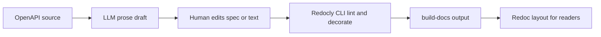

---
seo:
 title: Use AI to generate first drafts from your OpenAPI spec
 description: How to prompt an LLM from OpenAPI for summaries and examples, what humans must still verify, and how Redoc renders the page while Redocly CLI decorators and lint keep the spec trustworthy.
---

# Use AI to generate first drafts from your OpenAPI spec

The spec already names operations, parameters, and schemas. Readers still need prose that explains tasks, highlights required fields, and shows realistic examples. A large language model can draft that layer quickly, but it will invent details if you let it. Keep the spec authoritative, render with [Redoc CE documentation](https://redocly.com/docs/redoc), and run [Explore Redocly CLI](https://redocly.com/docs/cli/) with [API standards and governance](https://redocly.com/docs/cli/api-standards) so text and schema stay aligned before you ship.

This article covers what belongs in a first pass, what humans must verify, and how Redoc plus CLI decorators publish enriched output without silently rewriting the YAML people review in Git.

## What belongs in a first draft from OpenAPI

Readers search for a task before they read raw `paths`. A useful first pass adds a short overview per important operation, a parameter table that marks required fields, request and response examples grounded in schemas, and links to related errors or follow-on calls. Cover auth, pagination, idempotency, and limits once, then link from operations that depend on them.

Thin specs yield thin drafts. When descriptions are empty, paste release notes or FAQs beside the prompt and label them non-authoritative so nobody treats model text as a spec edit by accident.

## What models handle well versus what humans still own

Models compress structure into readable prose fast. They handle `oneOf` and discriminator shapes, summarize enums without raw JSON dumps, and draft curl-shaped examples when you name your stack.

Humans still own factual accuracy, legal wording, performance claims, and private routing rules the file never recorded. You own brand tone and which operations belong in public docs. If a field is deprecated in chat but not in OpenAPI, paste that fact next to the prompt or fix the spec first.

## How to prompt AI with your OpenAPI file

### Context block template

Paste something shaped like this before the YAML or JSON:

```markdown 
You are drafting human-facing API reference prose from OpenAPI 3.1.

Audience:
- Backend engineers integrating for the first time this week.

Rules:
- Do not invent endpoints, fields, status codes, or headers that are not in the pasted spec.
- When the spec is ambiguous, write "unspecified in OpenAPI" instead of guessing.
- Prefer short paragraphs and Markdown tables for parameters.

Deliverables per listed operationId:
1. A two to four sentence overview of what the call does in product terms.
2. A Markdown table: name, in, required, type, description (copy descriptions from the spec when present).
3. One request example and one success response example using realistic but fake data.
4. Links (relative Markdown) to auth and error reference pages if those paths exist in the same repo outline I paste below.
```

Paste the same OpenAPI slice readers will see, bundled if your repo splits files across folders. If navigation lives outside the spec, paste that outline too so cross-links in the draft match your sidebar.

### Review checklist for the model

Cover error bodies, security per operation, and any `examples` fields so JSON matches declared types. Require a short assumptions list anywhere the model went beyond the file.

## How Redoc turns the spec into a reference site

[Redoc CE documentation](https://redocly.com/docs/redoc) describes the three-panel layout readers expect: navigation, operation detail, nested schemas. Follow the [Redoc CE quickstart](https://redocly.com/docs/redoc/quickstart) or run the [build-docs command](https://redocly.com/docs/cli/commands/build-docs) through [Explore Redocly CLI](https://redocly.com/docs/cli/) so CI emits static HTML from the same file the model read.

When prose overclaims behavior, comparing the draft to the rendered schema panel surfaces the gap quickly.

## Where Redocly CLI decorators and lint fit

[Decorators](https://redocly.com/docs/cli/decorators) apply repeatable build-time edits: filter internal operations, add examples, or tune descriptions for publication while engineering keeps a stricter root file, as described under [API standards and governance](https://redocly.com/docs/cli/api-standards). That split helps when AI suggests friendlier copy you are not ready to merge into canonical YAML.

After you change the OpenAPI itself, run [built-in rules](https://redocly.com/docs/cli/rules/built-in-rules) through the [guide to configuring a ruleset](https://redocly.com/docs/cli/guides/configure-rules) so examples still validate and required fields stay consistent.

## What AI cannot guarantee

Models cannot certify that examples hit your staging stack, that quotas match production, or that legal text is correct per region. Pasting live tokens to chase realism leaks secrets.

Use AI to shorten reading time. Use reviewers plus automated lint to certify what readers may rely on.

## Best practices

1. Paste bundled OpenAPI or the exact slice you publish so paths and component names match what Redoc will render.
2. Ask the model to output a change list of assumptions separate from spec-backed text.
3. Put decorator-driven publication tweaks in `redocly.yaml` so they are reviewable like code.
4. Run lint on the spec after every merge that touches examples or descriptions.

## What this approach cannot replace

This approach cannot replace ship-team review, legal review of commitments, or research on the tasks readers perform. It speeds structure-to-HTML work; it does not transfer ownership of API behavior.

## How the pieces fit together



Structure becomes prose, then CLI tooling ties published pages back to the same rules on every build.

## Learn more

Start from [Redoc CE documentation](https://redocly.com/docs/redoc) and the [Redoc CE quickstart](https://redocly.com/docs/redoc/quickstart) when you want OpenAPI to become a navigable reference layout.

Add [Explore Redocly CLI](https://redocly.com/docs/cli/), the [build-docs command](https://redocly.com/docs/cli/commands/build-docs), and [decorators](https://redocly.com/docs/cli/decorators) when you want lintable specs, repeatable enrichments, and static HTML in one pipeline.
