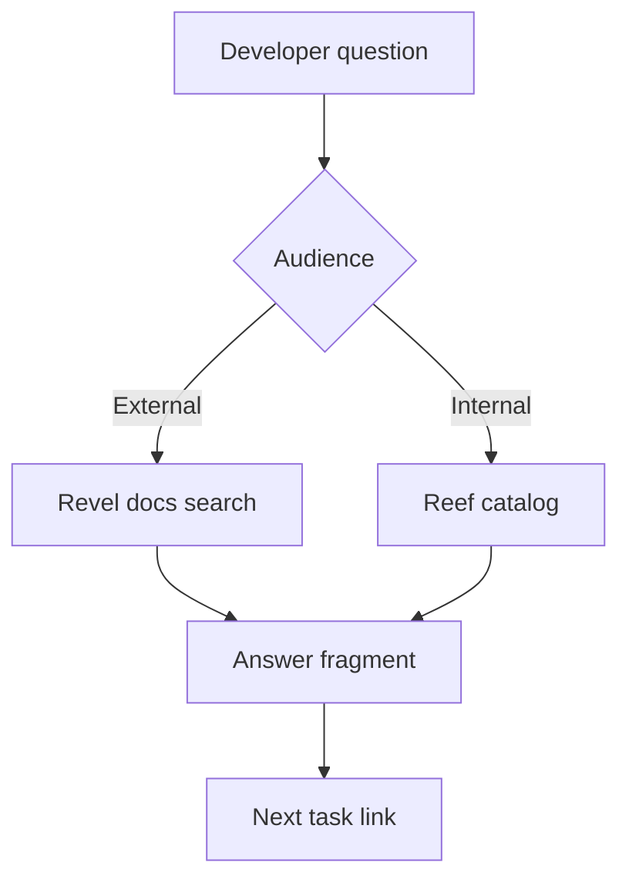

---
seo:
 title: Use AI to help developers find and understand your APIs faster
 description: Structure docs for task-shaped questions, use Revel for external developers and Reef for internal discovery, and expose llms.txt-style signals assistants can read.
---

# Use AI to help developers find and understand your APIs faster

Developers increasingly ask how do I authenticate instead of reading every guide in order. You can design for that shift by publishing clear external docs in Revel, maintaining an internal catalog in Reef, and shaping pages so search and assistants retrieve the right fragment on the first try. Task-based testing in [Use AI to test your documentation's usability](https://redocly.com/learn/ai-for-docs/ai-usability-testing) complements this work by showing where linear docs still fail.

## From linear reading to task-shaped questions

Traditional portals assume a patient reader who follows your table of contents. Integrators often arrive with a deadline and a single blocker. When assistants summarize docs, they reward pages that state prerequisites, show a minimal working request, and link errors to fixes. Write sections around tasks (`Get an access token`, `List webhooks`) rather than around internal team names.

The shift affects how you measure success. Page views can rise while time-to-first-successful-call stays flat. Track whether a reader completes a task without opening more than two pages. Usability testing with AI, described in the linked usability article, is one way to see where navigation still hides the answer.

## External developers and Revel

[Revel](https://redocly.com/revel) is the external developer portal surface where partners and customers onboard. Put authentication, rate limits, and quickstarts where search and navigation can reach them in one or two clicks. Configure hosted search and assistant features using [Search configuration](https://redocly.com/docs/realm/config/search) and [AI assistant configuration](https://redocly.com/docs/realm/config/ai-assistant) when your project uses those Realm options.

External readers care about stability promises and copy-paste examples. Keep changelog links adjacent to breaking changes.

For partner-only APIs, state entitlement requirements in the first paragraph so search does not surface steps the reader cannot run. Internal Reef entries can carry richer operational detail without exposing it on Revel.

## Internal teams and Reef

Employees need a different view: ownership, scorecards, and which API is canonical when duplicates exist. [Reef](https://redocly.com/reef) supports internal catalog and discovery so engineers do not file duplicate services. Pair Reef metadata with the same task headings you use externally so internal search returns familiar language.

## Doc structure models can navigate

Assistants retrieve smaller chunks when headings are specific and when each page answers one primary task. Put authentication before reference detail. Keep error codes on the same page as the operation they belong to. The [optimizations for LLMs](https://redocly.com/blog/optimizations-to-make-to-your-docs-for-llms) article lists practical edits that also help human skimmers.

### Page template you can reuse

```markdown 
# Task title (verb + object)

Prerequisites: links to auth and environment setup.

## Steps
Numbered calls with request and response samples.

## Errors
Table mapping codes to causes and fixes.

## Related
Links to adjacent tasks only.
```

## llms.txt and assistant-ready surfaces

Publish a machine-readable index such as [llms.txt](https://redocly.com/llms.txt) on your own site when you want tools to discover high-value entry points without crawling the entire portal. This does not replace good page structure, but it signals which guides matter most. MCP and similar integrations work best when underlying pages already separate tasks cleanly.

List only stable entry points in that index: authentication, quickstarts, changelog, and status. Rotate the list when you deprecate flows. Pair it with the lifecycle framing in [How AI fits into modern API documentation](https://redocly.com/learn/ai-for-docs/ai-modern-api-docs) so writers remember that assistants consume the same pages humans read.

### Retrieval-friendly snippets

Keep code samples copy-paste ready with real hostnames for sandbox, not placeholders like `api.example.com` unless your product truly uses them. Put scopes and headers in the first sample block. Models quote the first example more often than the third.



The diagram is simple on purpose: every answer should point to the next step.

## Best practices

Test five onboarding tasks monthly with only public docs, as described in the usability article.

Mirror task titles between internal and external docs when the workflow is the same.

Surface auth and environment setup on every quickstart, not only on a distant overview.

Measure time-to-first-successful-call, not page views alone.

Record which pages assistants cite when answers are wrong, then fix headings on those pages first.

Keep internal Reef entries linked from external Revel pages when partners should not see internal routes.

Review search queries quarterly and add missing task pages when the same question repeats.

Publish a short getting-started path that links three tasks in order so both humans and assistants follow the same sequence.

## What assistants cannot infer

Models guess when specs omit error shapes or when examples omit auth headers. They may combine outdated blog posts with current reference if you do not deprecate clearly. Assistants do not replace partner agreements or regulatory wording that legal must approve.

When you expose MCP tools to agents, document the same auth and rate limits on the human-facing page. Agents should not learn a shortcut that your public policy forbids. Internal Reef scorecards help engineers see which APIs are production-ready before external Revel pages promise the same stability.

## Summary

Serve external developers in Revel, internal discovery in Reef, and write both for task-shaped questions. Add search and assistant configuration deliberately, and keep pages small enough that the right fragment wins retrieval. Re-test onboarding tasks after every major navigation change.

## Learn more

[Revel](https://redocly.com/revel) is the external developer portal where structured quickstarts, search, and assistant features help integrators finish tasks without reading the entire site.
