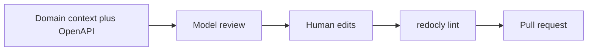

---
seo:
 title: Use AI to review API design for gaps and inconsistencies
 description: Share OpenAPI or design notes with a model to find missing workflows and inconsistent patterns, then validate changes with Redocly CLI lint before merge.
---

# Use AI to review API design for gaps and inconsistencies

You can ask a model to read OpenAPI or design notes before handlers ship, then gate changes with Redocly CLI lint in the same pull request. The learn article [Use AI to accelerate and improve reviews](https://redocly.com/learn/ai-for-docs/ai-reviews) covers the wider review pattern; here the focus stays on API shape, workflows, and naming drift while lint covers spec compliance and governance.

## When design review belongs before implementation

Early review is cheaper than retrofitting routes, error models, and pagination after clients exist. A model can scan many paths at once and compare them against the story you tell about actors, states, and edge cases. It does not replace your product judgment, but it gives you a second reader that is patient with long YAML.

## Inputs that make the review specific

Paste enough domain context that a newcomer could role-play your user. List primary actors, the workflows they care about, and the invariants you already know, for example holds on inventory or partial refunds.

Add either a full OpenAPI file or a curated excerpt. If the file is huge, scope the excerpt to the surface you are changing and link to the rest in prose. The goal is signal density, not token volume for its own sake.

### Domain context block you can paste

```markdown 
Context: We run a small logistics network for cold freight.
Actors: shippers, carriers, warehouse staff.
Workflows: booking a lane, changing pickup windows, recording temperature excursions.

Review this OpenAPI excerpt for gaps and inconsistencies:
[paste paths, schemas, or notes]
```

## Prompt skeleton for gaps and inconsistencies

Keep the ask structured so the answer is easy to triage. You can start from this outline and tune nouns to your domain.

```markdown 
You are reviewing an API design for [one sentence domain].

Please list:
1. Missing CRUD or state transitions implied by the domain but absent from paths.
2. Incomplete workflows where a user would reach a dead end.
3. Naming inconsistencies across resources, parameters, and schema fields.
4. Edge cases we should model explicitly, including error shapes.
5. Authentication or authorization gaps relative to the described roles.

[paste OpenAPI or notes]
```

## Signals the model often finds

Across teams, the same review surfaces a short set of themes. Missing companion operations appear when create exists without read or cancel. URL style drifts between `/resource/{id}` and query variants for the same concept. Domain gaps show up when a user can start a workflow but cannot observe status or reverse an action. Security gaps cluster around admin-only routes that lack explicit scopes or consistent error contracts.

Treat the list as a prioritized backlog, not a verdict. Some suggestions will not fit your roadmap or risk appetite.

## Thin before and after on paths and verbs

Before:

```yaml 
paths:
  /shipments:
    post:
      summary: Create shipment
```

After:

```yaml 
paths:
  /shipments:
    post:
      summary: Create shipment
    get:
      summary: List shipments for the authenticated account
  /shipments/{shipmentId}:
    get:
      summary: Retrieve a single shipment
    patch:
      summary: Update allowed fields on a draft shipment
```

The second sketch does not prove correctness, but it shows how a gap review nudges you toward coherent CRUD before you wire handlers.



The loop is intentionally short. You want feedback while the design is still cheap to edit.

## Run lint after you merge suggestions

When you accept changes, run the [lint command](https://redocly.com/docs/cli/commands/lint) against the same file the model saw. Lint applies preprocessors and rules, reports problems in OpenAPI and related formats, and does not run decorators, which keeps this step focused on spec shape.

In continuous integration, you can point the same command at pull requests so every spec edit repeats the same checks your authors run locally. That repetition matters because models sometimes suggest keywords or vendor extensions your ruleset has not whitelisted yet, and lint catches those mismatches early.

If you have no local config yet, the command defaults to the [recommended ruleset](https://redocly.com/docs/cli/rules/recommended). You can extend coverage with [built-in rules](https://redocly.com/docs/cli/rules/built-in-rules) and [configurable rules](https://redocly.com/docs/cli/rules/configurable-rules) as your standards mature.

## Align checks with governance

Organizations that treat OpenAPI as law usually centralize how rules are authored and shared. The [API standards and governance](https://redocly.com/docs/cli/api-standards) page describes how CLI and hosted flows can reuse the same configuration so developers see the same violations locally and in automation. For first-time setup, the [guide to configuring a ruleset](https://redocly.com/docs/cli/guides/configure-rules) walks through a practical baseline you can grow over time.

## Best practices

Ship context, not vibes. Short checklists beat long prose in the prompt.

Review one theme at a time when the file is large, for example naming first, then errors, then pagination.

Log model findings as tickets with spec anchors so humans can accept or reject with traceability.

Combine model passes with deterministic tools so subjective completeness meets objective gates, which mirrors the guidance in [Use AI to accelerate and improve reviews](https://redocly.com/learn/ai-for-docs/ai-reviews).

## Limits of this pairing

Models do not know your private roadmap, real traffic mixes, or regulatory commitments unless you state them. They can hallucinate fields or routes if you ask for rewrites without grounding them in your repository facts. Lint cannot judge whether a workflow is fair to users, only whether the document obeys configured rules.

## Summary

Use a structured prompt plus domain context to surface gaps early, then let Redocly CLI enforce the rules your team already agreed to. Keep humans in the loop for trade-offs, and treat automation as a safety net rather than a substitute for product sense.

## Learn more

When you are ready to wire the deterministic side of the loop, start with [Explore Redocly CLI](https://redocly.com/docs/cli/) for installation, first commands, and how lint fits alongside bundling and preview workflows described in the broader [rulesets](https://redocly.com/docs/cli/rules) documentation.
