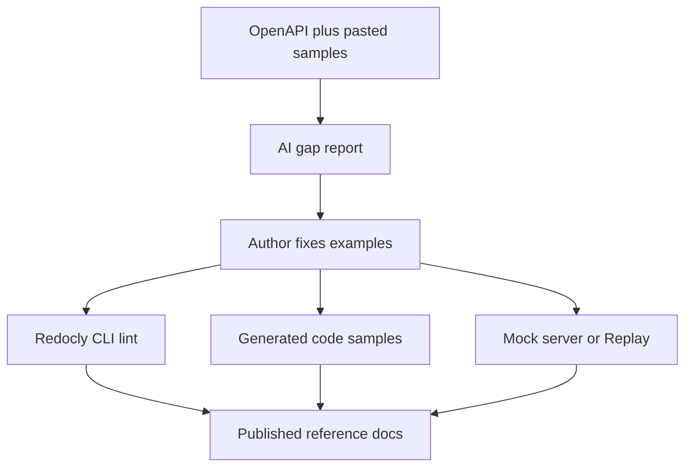

---
seo:
 title: Use AI to review code examples for completeness and accuracy
 description: How to prompt AI to audit request samples against your OpenAPI spec, which gaps models catch, and how Redocly code sample generation, mock server, and CLI lint give you a runnable baseline.
---

# Use AI to review code examples for completeness and accuracy

Developers copy the curl block or SDK snippet before they read the prose. When auth headers are missing, optional query params disappear, or the JSON shape no longer matches the schema, integrations fail in silence until someone files a ticket. A large language model can compare pasted examples to your OpenAPI slice and flag pattern gaps fast. You still need deterministic checks so the samples readers copy match what your spec and mock server actually return.

This article covers the failures that show up most often, how to prompt for a structured review, and how [Redoc CE documentation](https://redocly.com/docs/redoc), [generate code samples automatically](https://redocly.com/docs/api-reference-docs/guides/generate-code-samples), the [configure mock server](https://redocly.com/docs/realm/content/api-docs/configure-mock-server) flow, and the [lint command](https://redocly.com/docs/cli/commands/lint) through [Explore Redocly CLI](https://redocly.com/docs/cli/) close the loop after AI suggests fixes.

## Common ways code examples drift from the spec

Pseudocode that looks runnable is the usual culprit. Tutorials show `fetch('/users')` without the base URL your `servers` block defines, or they omit the `Content-Type` header when the operation expects JSON.

Auth gaps appear when global `security` applies but the snippet is anonymous. Multi-scheme specs make this worse: generated samples often include only the first scheme unless you document the others beside the example.

Schema drift shows up as field names from an old release, numbers sent as strings, or nested objects flattened. Optional parameters vanish from copy-paste-friendly snippets even when the operation lists them, which hides pagination and filter behavior new integrators need.

Outdated SDK syntax is harder for linters alone. A model that knows your pinned library version can flag deprecated method names if you state the version in the prompt.

## What to paste beside the OpenAPI slice

Give the model the same operation definitions readers see, including `requestBody`, `parameters`, `security`, and any `examples` or [x-codeSamples extension](https://redocly.com/docs/api-reference-docs/specification-extensions/x-code-samples) blocks. Paste tutorial snippets from Markdown or your docs repo as separate labeled files so the model knows which text is canonical.

Add a short stack note: language, HTTP client, whether examples should use the first `servers` URL or a named environment. List environment variable placeholders you expect, such as `API_KEY` or `BASE_URL`, so the review can flag hard-coded secrets or missing substitution.

State which samples are hand-written versus generated. Custom `x-codeSamples` override auto-generated tabs for that language, so reviewers should not treat generated curl as the source of truth when a custom block exists.

## Prompt template for an example review

Use a checklist-shaped prompt so output is actionable in a PR comment.

```markdown 
You are reviewing API code examples against OpenAPI 3.1.

Stack: Node 20, undici fetch, bearer token auth.

Rules:
- Flag any field, header, path, or status code not supported by the pasted spec.
- Flag missing required parameters, auth, or content types.
- Flag JSON that would fail validation against the declared schema.
- Do not rewrite examples unless asked; output a table of issues with severity.

Deliverables:
1. Table: location, issue, spec reference, suggested fix.
2. List of operations with no example at all.
3. Assumptions you made about base URL or auth.
```

Ask for severity so authors can fix blockers before polish. Require an explicit assumptions section anywhere the model inferred behavior the file does not state.

### Review checklist for humans after the model runs

Confirm error responses for auth failures are demonstrated when your security section requires them. Check that pagination parameters appear in at least one list example when the schema supports them. Compare Content-Type and Accept headers to what the operation declares.

Run the same checklist on release notes when they include one-off curl blocks outside the spec repo.

## Before and after a single operation

Before, a hand-written curl omits auth and sends the wrong field name:

```bash
curl -X POST https://api.example.com/v1/events \
  -H "Content-Type: application/json" \
  -d '{"title":"Pool party","when":"2026-06-01"}'
```

After alignment with the spec, the snippet names the bearer scheme, uses `name` and `startDate`, and points readers to the documented server URL:

```bash
curl -X POST "https://api.example.com/v1/events" \
  -H "Authorization: Bearer $ACCESS_TOKEN" \
  -H "Content-Type: application/json" \
  -d '{"name":"Pool party","startDate":"2026-06-01"}'
```

AI can produce the gap table that motivates this edit. Your reviewers still approve whether the example should show optional fields or a minimal payload.

## Build a deterministic baseline readers can trust

[Generate code samples automatically](https://redocly.com/docs/api-reference-docs/guides/generate-code-samples) creates request tabs from the same OpenAPI fields your lint rules guard. Configure languages in your API reference docs settings or `redocly.yaml` so curl, JavaScript, or Python tabs stay in sync when parameters change. Remember that auto-generated tabs are not available in Redoc CE alone; CE still renders samples you embed with [x-codeSamples extension](https://redocly.com/docs/api-reference-docs/specification-extensions/x-code-samples).

The [configure mock server](https://redocly.com/docs/realm/content/api-docs/configure-mock-server) option serves example responses without a live backend. Use `strictExamples` when you want responses to match documented JSON exactly, or relax it when you want request values echoed for interactive demos. Send the same request through [Replay API explorer](https://redocly.com/docs/end-user/test-apis-replay) after you change an example to see whether the mock returns the status and body your text promises.

Treat generated curl and mock responses as the baseline. Ask AI to diff hand-written tutorials against that baseline instead of against memory.

## Where Redocly CLI lint fits

Run the [lint command](https://redocly.com/docs/cli/commands/lint) on every spec change that touches examples. [built-in rules](https://redocly.com/docs/cli/rules/built-in-rules) catch structural problems, such as invalid references or missing operation metadata, while you can extend coverage through the [guide to configuring a ruleset](https://redocly.com/docs/cli/guides/configure-rules).

Lint proves the `examples` payload matches declared types. It does not know whether your Python import path exists on PyPI this week. Keep AI review for readability and library idioms; keep CLI lint for contract truth on the OpenAPI file itself.

## What AI cannot verify

Models do not execute code against your staging stack unless you wire a separate agent with credentials, which most doc teams avoid in review bots. They cannot confirm rate limits, regional endpoints, or private headers you never added to the spec.

Pasting production tokens into a chat to test realism leaks secrets. Use placeholder env vars in examples and mock server calls instead.

## Best practices

1. Paste bundled OpenAPI for the operations your tutorial covers so component schema names match lint output.
2. Keep hand-written samples in Git beside the spec or in `x-codeSamples` so diffs stay reviewable.
3. Compare AI findings to generated curl and one mock server response before you merge doc changes.
4. Re-run [Explore Redocly CLI](https://redocly.com/docs/cli/) lint after every edit to `examples` or sample extensions.

## What this approach cannot replace

This approach cannot replace SDK maintainer review, security review of credential handling, or user research on which tasks need copy-paste samples versus conceptual explanation. AI accelerates gap detection; mock server and lint prove the contract layer.

## How the pieces fit together



AI surfaces mismatches, then lint, generated samples, and mock responses keep published tabs aligned with the spec.

## Learn more

Start from [Redoc CE documentation](https://redocly.com/docs/redoc) when you want OpenAPI-backed reference pages that display the samples you certify in Git.

Add [Explore Redocly CLI](https://redocly.com/docs/cli/), the [lint command](https://redocly.com/docs/cli/commands/lint), and [generate code samples automatically](https://redocly.com/docs/api-reference-docs/guides/generate-code-samples) when you want lintable specs, generated request tabs, and mock server checks in one pipeline.
