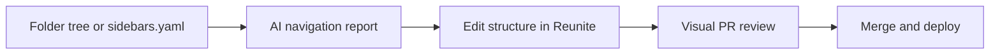

---
seo:
 title: Use AI to review your docs navigation structure
 description: How to paste a sitemap or folder tree for AI review, which navigation mistakes models flag for new readers, and how Reunite visual pull request review validates a restructure before publish.
---

# Use AI to review your docs navigation structure

Readers decide whether your API is approachable before they read a single endpoint description. They scan the sidebar, search for authentication, and bail when errors live three levels deep under a label that sounds unrelated. A large language model cannot replace analytics, but it can read your folder tree or `sidebars.yaml` outline and flag patterns that confuse first-time integrators.

This article shows what to paste into a navigation review, the problems that show up repeatedly, a before-and-after tree you can adapt from [Use AI to accelerate and improve reviews](https://redocly.com/learn/ai-for-docs/ai-reviews), and how to validate the restructure in [Reunite](https://redocly.com/reunite) before you merge.

## What to share with the model

Paste the structure readers actually see, not an internal wiki map. That usually means a folder tree from your docs repo, the ordered list from [Sidebars configuration options](https://redocly.com/docs/realm/navigation/sidebars), or an export of your published sidebar labels.

Add a short persona block: who arrives cold this week, what they need to accomplish in the first session, and which pages you consider prerequisites. Without tasks, the model defaults to generic "logical grouping" advice.

Note whether navigation is file-driven or explicit. [Navigation in Realm](https://redocly.com/docs/realm/navigation/navigation) explains that missing `sidebars.yaml` often means order follows the file tree, which may not match how you want newcomers to read.

## Prompt template for a navigation review

Keep the prompt checklist-shaped so output is actionable in a restructuring PR.

```markdown 
You are reviewing documentation navigation for a first-time API integrator.

Tasks they must complete in order:
1. Create an account and obtain API credentials
2. Authenticate and make a first successful request
3. Handle common errors and rate limits
4. Subscribe to webhooks for order updates

Review the pasted folder tree and answer:
1. Which tasks are hard to discover from the sidebar alone?
2. Which sections are too deep (more than two clicks from a sensible entry point)?
3. Which topics are split across unrelated top-level groups?
4. Propose a revised tree with one-line justification per move.
5. List assumptions about reader skill level.
```

Ask for a table of moves rather than a full rewrite of every filename so authors can apply changes incrementally.

## Problems AI often flags for new readers

Authentication buried under advanced guides is the classic miss. Integrators expect auth beside getting started, not under a catch-all reference folder they open only after a failed curl.

Error and rate-limit content separated from the operations that trigger those responses forces readers to context-switch. Models often suggest moving error catalogs adjacent to API reference or linking them prominently from getting started.

Examples orphaned at the root while conceptual guides sit elsewhere make tutorials feel optional when they are the real on-ramp. Webhooks promoted to top level without a prerequisite auth page strand readers who land from search.

Orphan pages with no parent group show up when teams add files faster than they update [Sidebars configuration options](https://redocly.com/docs/realm/navigation/sidebars). Ask the model to list files that appear disconnected from any stated task flow.

## Before and after a flat top-level layout

The learn article on reviews uses a flat tree where foundational topics compete with reference material:

```
docs/
├── getting-started/
├── api-reference/
├── webhooks/
├── authentication/
├── rate-limiting/
├── errors/
└── examples/
```

A tighter shape for the same content groups onboarding, nests errors with reference, and tuck examples under guides:

```
docs/
├── getting-started/
│   ├── authentication.md
│   ├── first-api-call.md
│   └── rate-limits.md
├── api-reference/
│   ├── endpoints/
│   └── errors.md
├── guides/
│   ├── webhooks.md
│   └── examples/
└── advanced/
```

The moves are explainable in reader terms. Authentication and rate limits belong with first steps. Errors are reference material readers consult from operation pages. Examples are guides, not a peer of the API catalog.

Your product names differ, but the pattern repeats: pull prerequisites up, push deep reference down, and reduce top-level siblings.

## Validate the restructure in Reunite before publish

AI proposes moves. Humans still need to see rendered navigation with real labels and cross-links. Edit `sidebars.yaml` or move files in the [use the editor](https://redocly.com/docs/realm/reunite/project/use-editor) flow, open a pull request, and ask reviewers to use [review a pull request in Reunite](https://redocly.com/docs/realm/reunite/project/pull-request/review-pull-request).

The Review tab opens in Visual view by default, showing rendered pages before and after your changes. That is the right place to confirm a moved auth page still reads well in context and that examples under guides did not break sidebar depth.

Toggle to Code when you need to verify `sidebars.yaml` ordering line by line. Filter the file tree on large PRs so reviewers can focus on navigation files first.

Treat the visual diff as the acceptance test for the AI plan. If the sidebar still hides credentials behind three clicks in the preview, reject the merge even when the folder tree looks tidy in Git.

## What AI cannot infer about your audience

Models do not see search console data, support ticket tags, or which pages your sales team demos most. They may over-weight alphabetical order or symmetry when your readers arrive from one high-intent landing page.

They also cannot know internal politics about which product name must appear in a top-level label. Use AI for reader-task fit; use stakeholders for naming commitments.

## Best practices

1. Paste the same sidebar order production uses, including hidden or draft sections you plan to publish soon.
2. List five to eight first-week tasks explicitly so the model judges discoverability against work, not aesthetics.
3. Apply navigation changes in a dedicated PR with only IA edits when possible so visual review stays focused.
4. Re-run the prompt after major feature launches because new guides often land as orphan files.

## What this approach cannot replace

This approach cannot replace quantitative path analysis, card-sort studies with real users, or accessibility review of navigation landmarks. It speeds structural critique before you invest in a full rework.

## How the pieces fit together



The model narrows which moves are worth trying; Reunite visual review proves the sidebar works for humans.

## Learn more

When you want Git-backed editing, pull request review, and side-by-side visual diffs on navigation changes, start with [Reunite](https://redocly.com/reunite) and the [Reunite documentation](https://redocly.com/docs/realm/reunite/reunite) hub for editor and review workflows.
